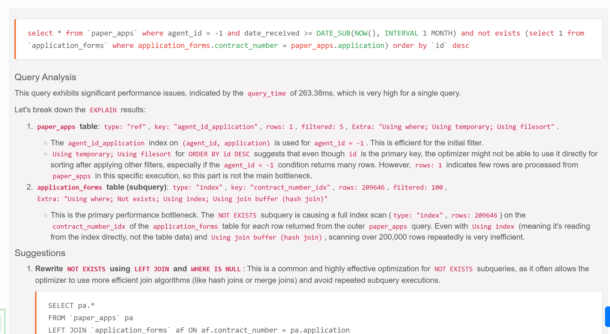

[![Latest Version on Packagist][ico-version]][link-packagist]
[![Total Downloads][ico-downloads]][link-downloads]
[](https://opensource.org/licenses/MIT)



# AI Query Optimizer for Laravel

A Laravel development tool that leverages the intelligence of AI to analyze and optimize your application's SQL queries. This package provides real-time, actionable feedback directly in your browser, helping you identify performance bottlenecks and improve your database efficiency.

## Features

- **On-Demand Query Analysis**: Get instant feedback on your `SELECT` queries with the click of a button.
- **AI-Powered Suggestions**: Utilizes AI (Gemini or OpenAI) to provide expert-level optimization advice.
- **Intelligent UI**: A non-intrusive, floating button displays the query count and opens a modal for detailed analysis.
- **Table & Index Awareness**: The AI is provided with your database schema context to give relevant and practical suggestions, avoiding redundant index recommendations.
- **Duplicate Query Handling**: Intelligently groups identical queries and shows how many times each was executed.
- **AJAX Support**: Automatically captures queries made during AJAX/fetch requests.
- **Caching**: Caches AI analysis to prevent redundant API calls and reduce costs.
- **Easy Configuration**: Highly configurable, allowing you to specify AI providers, API keys, and application environments.
- **Syntax Highlighting**: Presents SQL queries in a clean, readable format.

## Requirements

- PHP 8.2+
- Laravel 10, 11, or 12

## Installation

You can install the package via Composer:

```bash
composer require sarfraznawaz2005/aiqueryoptimizer --dev
```

Next, publish the configuration and assets using the `vendor:publish` command. This will create the `config/ai-query-optimizer.php` file and publish the necessary CSS/JS assets to your `public` directory.

```bash
php artisan vendor:publish --provider="AIQueryOptimizer\AIQueryOptimizerServiceProvider"
```

## Configuration

After publishing, open `config/ai-query-optimizer.php` to configure the package.

### 1. Enable the Package

By default, the package is enabled. You can disable it by setting the `enabled` option to `false` or by using the `AI_QUERY_OPTIMIZER_ENABLED` environment variable.

```php
'enabled' => env('AI_QUERY_OPTIMIZER_ENABLED', true),
```

### 2. Set Allowed Environments

To prevent the package from running in a production environment, it is restricted to specific environments. By default, it only runs in `local`, `development`, and `staging`.

```php
'allowed_environments' => ['local', 'development', 'staging'],
```

### 3. Configure Your AI Provider

The package supports both Gemini and OpenAI. You need to configure your chosen provider with the appropriate API key and model.

Update your `.env` file, example with Gemini:

```env
AI_QUERY_OPTIMIZER_ENABLED=true
AI_PROVIDER=gemini
GEMINI_API_KEY=your_gemini_api_key
GEMINI_MODEL="gemini-2.5-flash"

```

### 4. Caching

Caching is enabled by default to reduce API costs. The analysis for each unique query will be cached for a day. You can disable it or change the duration.

```php
'cache' => [
    'enabled' => true,
    'duration_in_minutes' => 60 * 24, // Cache for one day
],
```

## Usage

Once installed and configured, the package works automatically in your specified environments.

1. **Navigate Your Application**: As you use your application, the optimizer will collect all `SELECT` queries in the background.
2. **Floating Button**: You will see a floating "AI Query Check" button at the bottom-right of your screen, showing the number of unique queries captured.
3. **Analyze Queries**: Click the button to open the analysis modal. The package will send the collected queries to the configured AI for analysis.
4. **Review Suggestions**: The modal will display each query along with the AI's analysis and optimization suggestions. Queries that are already optimized are highlighted in green.

## How It Works

The package hooks into Laravel's query execution event to collect all `SELECT` queries. It then injects a small UI component into your application's frontend. When you trigger the analysis, it sends the queries, along with your database table and index metadata, to the AI. The AI, acting as a database expert, returns detailed suggestions which are then displayed in a user-friendly format.

## Security

This is a development tool and should **not** be used in a production environment. Always ensure your API keys are stored securely in your `.env` file and are not committed to version control.

## Credits

- [Sarfraz Ahmed][link-author]
- [All Contributors][link-contributors]

## License

Please see the [license file](LICENSE) for more information.

[ico-version]: https://img.shields.io/packagist/v/sarfraznawaz2005/aiqueryoptimizer.svg?style=flat-square
[ico-downloads]: https://img.shields.io/packagist/dt/sarfraznawaz2005/aiqueryoptimizer.svg?style=flat-square

[link-packagist]: https://packagist.org/packages/sarfraznawaz2005/aiqueryoptimizer
[link-downloads]: https://packagist.org/packages/sarfraznawaz2005/aiqueryoptimizer
[link-author]: https://github.com/sarfraznawaz2005
[link-contributors]: https://github.com/sarfraznawaz2005/aiqueryoptimizer/graphs/contributors
